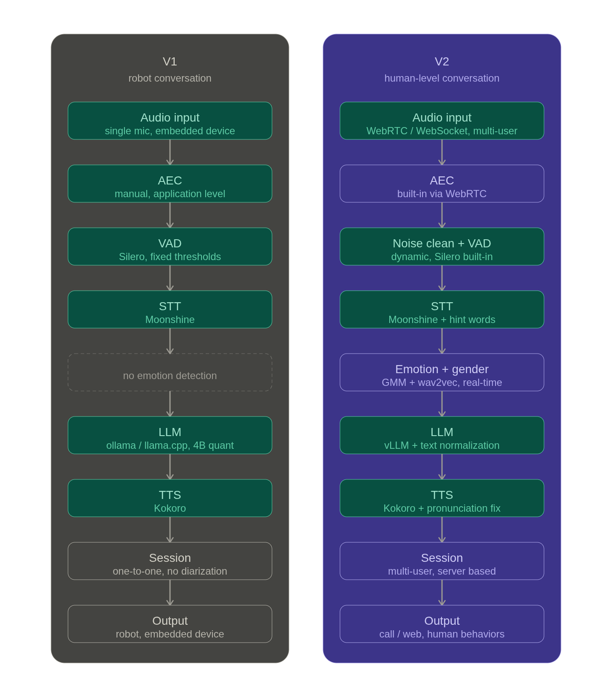

# Human Voice

A real-time AI voice conversation system, built to feel as close to a human call as possible.

---

## V1 — Robot Conversation System

V1 was built for embedded systems, focused on one-to-one real-time voice conversations, primarily targeting robot interaction use cases.

**Stack**
- LLM: Ollama or llama.cpp with 4B parameter quantized models
- STT: Moonshine (Silero VAD built-in)
- TTS: Kokoro
- AEC: Acoustic echo cancellation handled manually

**Limitations**
- One-to-one only, no multi-user support
- Speaker diarization was not properly implemented
- Designed for embedded/robot contexts, not human-facing calls
- AEC had to be managed at the application level

---

## V2 — Human-Level Conversation System

V2 shifts focus entirely to human-level conversation, designed for web and call-based deployments with multi-user server architecture.

**Stack**
- LLM: vLLM served models (quantized, fully open source, no APIs)
- STT: Moonshine (Silero VAD built-in)
- TTS: Kokoro with pronunciation correction and text normalization
- Emotion & Gender Detection: GMM + wav2vec clustering, runs in real time

**What's new in V2**

- Multi-user session based — server handles concurrent users, not just one-to-one
- No manual AEC needed — WebRTC has it built-in, WebSocket transport has negligible echo issues
- Real-time emotion and gender detection fed as context to the LLM
- Hint words in STT to guide recognition for domain-specific terms
- TTS pronunciation correction so names, acronyms, and unusual words come out right
- Text normalization before LLM input — numbers, symbols, abbreviations handled cleanly
- Noise cleaning on incoming audio
- Dynamic VAD — adapts thresholds based on environment rather than fixed cutoffs
- Voice-based call behaviors — detects natural endings ("alright thanks", "bye") and ends the call gracefully; says "hello?" or prompts the user if they go silent after speaking
- Focused on call and web interfaces, not embedded systems

**Constraints**
- Fully open source, zero paid APIs
- Everything fits under 4GB VRAM

---

## Goal

Make AI voice conversations indistinguishable from talking to a real person on a call.
